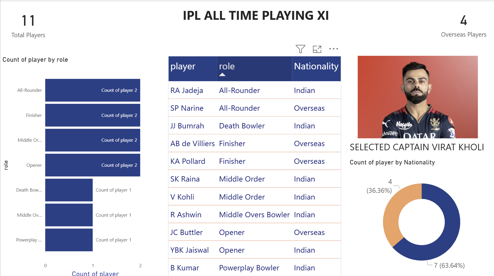

---

## 🔁 Analytical Pipeline

### 1️⃣ YAML → CSV
- Parses nested Cricsheet YAML files
- Extracts match-level and delivery-level data

**Outputs**
- `matches.csv`
- `deliveries.csv`

---

### 2️⃣ Data Cleaning
- Legal vs illegal deliveries
- Phase tagging
- Dismissal normalization

**Output**
- `deliveries_cleaned.csv`

---

### 3️⃣ Batting Feature Engineering
- Strike rate, average
- Phase-wise strike rates
- Balls faced per phase per match

**Output**
- `batting_features_final_v2.csv`

---

### 4️⃣ Bowling Feature Engineering
- Economy, wickets
- Phase-wise economy
- Balls bowled per phase

**Output**
- `bowling_metrics.csv`

---

### 5️⃣ Role-Based Filtering
Players are filtered into:
- Openers
- Middle order
- Finishers
- All-rounders
- Powerplay bowlers
- Middle overs bowlers
- Death bowlers

Each role has **minimum workload + dominance thresholds**.

---

### 6️⃣ Scoring & Final XI Selection
- Role-wise scoring
- Duplicate resolution
- Foreigner constraint enforcement
- Ordered team composition

**Final Output**
- `final_playing_xi.csv`

---

## 🏏 Final Playing XI (v1)

| Order | Player | Role |
|------|------|------|
| 1 | YBK Jaiswal | Opener |
| 2 | JC Buttler | Opener |
| 3 | SK Raina | Middle Order |
| 4 | V Kohli | Middle Order |
| 5 | KA Pollard | Finisher |
| 6 | AB de Villiers | Finisher |
| 7 | RA Jadeja | All-Rounder |
| 8 | SP Narine | All-Rounder |
| 9 | B Kumar | Powerplay Bowler |
|10 | R Ashwin | Middle Overs Bowler |
|11 | DJ Bravo / Indian Death Bowler | Death Bowler |

(≤ 4 overseas players enforced)

---

## 📈 Visualization Layer

The visualization notebooks validate:
- Phase dominance
- Role separation
- Usage vs performance
- Final XI balance

These plots justify **why each player belongs to their role**.

---
## 🖼 Dashboard Preview

## 🔒 Project Status

- **Version**: v1 (Locked)
- **Logic**: Deterministic & explainable
- **Changes**: No further modifications to v1 logic

---

## 🚀 Future Enhancements

- Pitch-specific Playing XI
- Opposition-based selection
- Recent-form weighting
- Interactive dashboard

---

## 👤 Author

**Sharana Basava**  
GitHub: https://github.com/SharanaBasava18